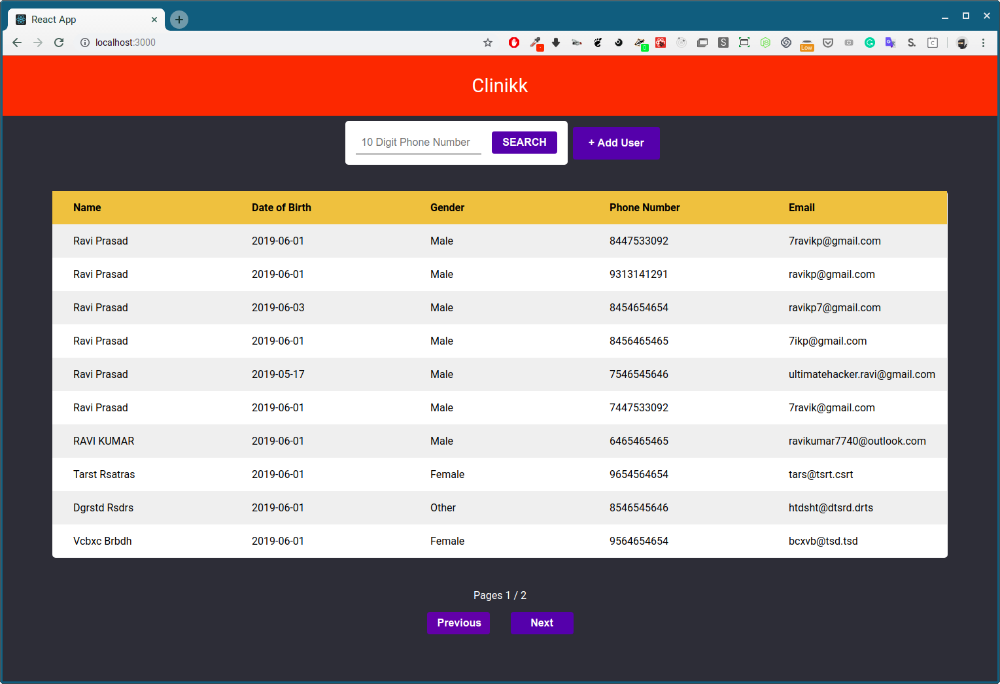
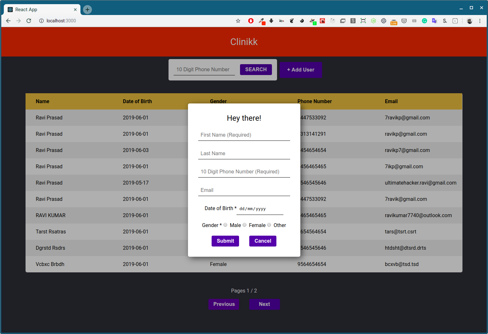
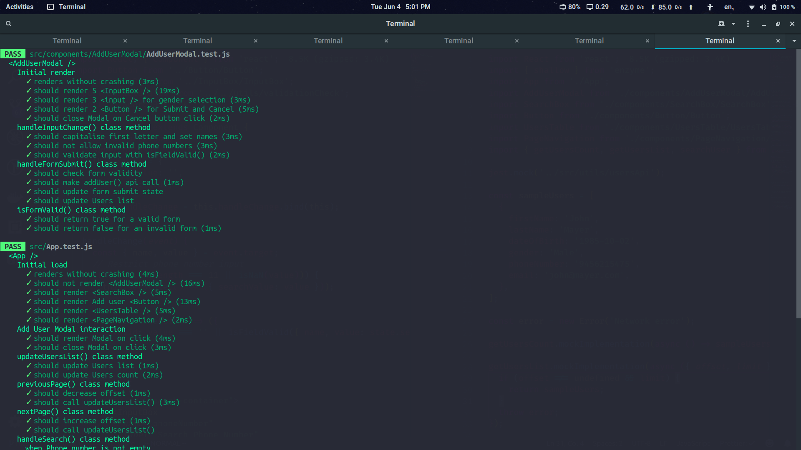
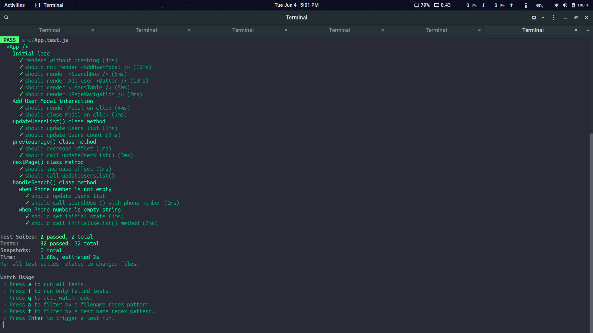
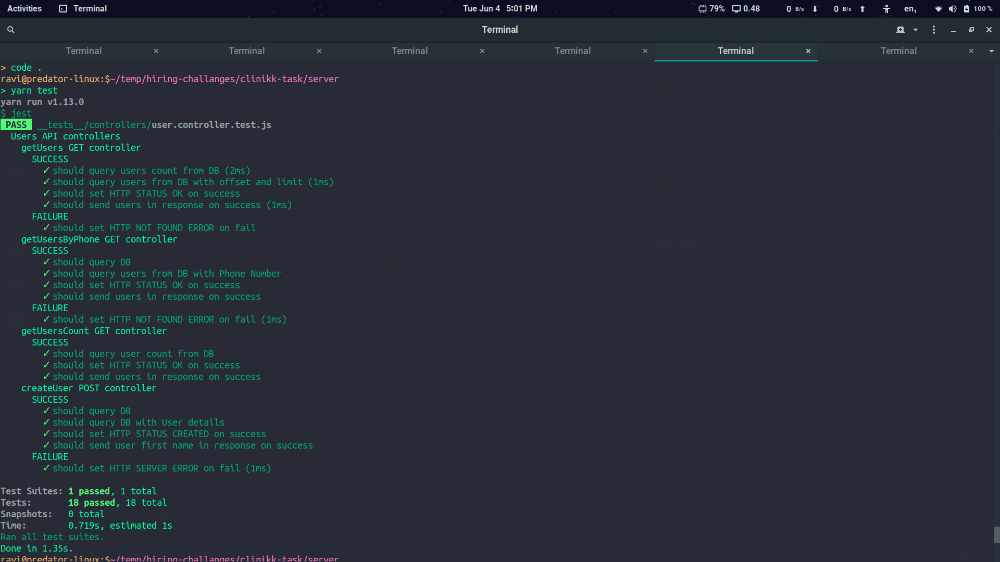

## Clinikk Assignment

---

### Installation

```
yarn
```

### Testing

```
yarn test
```

### Local run setup

- Run MongoDB daemon
- `.env` for env variables is included in `/server`, not recommended for production app though
- Run `yarn start` from both `/client` and `/server`

### Screenshots






